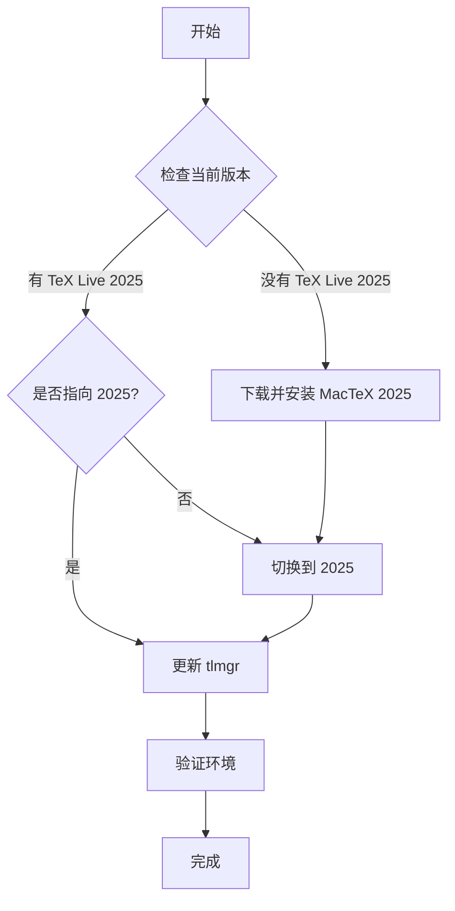
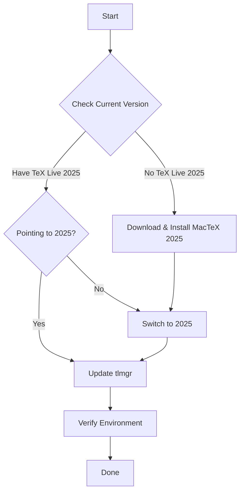

# MacTeX 2025 管理指南

[🇨🇳 中文](#mactex-2025-管理指南) | [🇺🇸 English](#mactex-2025-management-guide)

模板 **只支持 MacTeX 2025**。本文档提供完整的安装、切换和配置流程，确保无论你当前处于什么状态，都能顺利配置好环境。

---

## 📋 快速工作流



**核心流程：检查版本 → 安装/切换 → 更新宏包 → 验证成功**

---

## 步骤 1：检查当前版本
```bash
/Library/TeX/texbin/xelatex --version | head -1
```
- 输出包含 `TeX Live 2025`：表示当前已指向 2025，直接执行 [步骤 3](#3-更新-tlmgr)。
- 输出为其他年份：继续查看已安装版本。

## 步骤 1：检查当前版本

首先检查你的系统是否已安装 TeX Live，以及当前激活的是哪个版本：

```bash
/Library/TeX/texbin/xelatex --version | head -1
```

**根据输出结果判断：**

| 输出结果 | 说明 | 下一步 |
|---------|------|--------|
| 包含 `TeX Live 2025` | ✅ 已正确配置 2025 | 直接跳到 [步骤 3](#步骤-3更新-tlmgr必做) |
| 包含其他年份（如 2024/2023） | ⚠️ 已安装但版本不对 | 继续步骤 1.1 |
| 命令不存在/报错 | ❌ 未安装 MacTeX | 继续步骤 1.1 |

### 1.1 查看所有已安装的 TeX Live 版本

```bash
ls -d /usr/local/texlive/[0-9]* 2>/dev/null | xargs -n1 basename
```

**根据输出结果判断：**

- **输出包含 `2025`**：说明 2025 已安装，只需切换 → 前往 [步骤 2.2](#22-切换到-mactex-2025)
- **输出不包含 `2025` 或无输出**：需要全新安装 → 前往 [步骤 2.1](#21-全新安装-mactex-2025)

---

## 步骤 2：安装或切换到 MacTeX 2025

根据步骤 1 的检查结果，选择对应的操作：

### 2.1 全新安装 MacTeX 2025

**适用场景**：系统中没有 TeX Live 2025，需要从零开始安装。

#### 2.1.1 下载安装包

安装包大小约 **5 GB**，推荐使用清华镜像加速下载：

```
https://mirror.tuna.tsinghua.edu.cn/ctan/systems/mac/mactex/MacTeX.pkg
```

- 在浏览器（Safari/Chrome）中打开上述链接即可自动下载
- 下载完成后会得到 `MacTeX.pkg` 文件

#### 2.1.2 安装

1. 双击 `MacTeX.pkg` 启动安装向导
2. 按照提示完成安装（需要管理员密码）
3. 默认安装路径：`/usr/local/texlive/2025`

#### 2.1.3 验证安装

```bash
ls -d /usr/local/texlive/2025
```

如果输出路径存在，说明安装成功。

**⚠️ 安装完成后，必须继续执行步骤 2.2 进行路径配置！**

### 2.2 切换到 MacTeX 2025

**适用场景**：
- 刚完成步骤 2.1 的全新安装
- 或系统中已有 2025，但当前激活的是其他版本

本仓库提供了自动切换脚本 `switch-texlive.sh`，用于更新系统软链接。

#### 2.2.1 进入脚本目录

```bash
cd MacTex_Installation_Settings
```

#### 2.2.2 查看当前状态（可选）

```bash
./switch-texlive.sh
```

脚本会显示：
- 当前激活的 TeX Live 版本
- 系统中所有已安装的版本

#### 2.2.3 切换到 2025

```bash
./switch-texlive.sh 2025
```

- 需要输入管理员密码（sudo）
- 脚本会自动找到正确的 `bin` 目录并更新 `/Library/TeX/texbin` 软链接

#### 2.2.4 验证切换结果

```bash
/Library/TeX/texbin/xelatex --version | head -1
```

确认输出中包含 `TeX Live 2025`。

**⚠️ 如果使用 VS Code、TeXstudio 等编辑器，请重启编辑器以加载新路径！**

---

## 步骤 3：更新 tlmgr（必做）

无论你是刚安装的 2025，还是从旧版本切换过来的，**都必须执行此步骤**！

### 3.1 为什么必须更新？

> ⚠️ **重要提示**：作者本人曾因遗漏此步骤，导致编译出的 PDF 图片位置错乱。

MacTeX 安装包中的宏包版本可能已过时，`tlmgr update` 会：
- 更新 `tlmgr` 工具自身
- 更新所有 LaTeX 宏包到最新版本
- 修复已知的 bug（如 `xdvipdfmx` 图片定位问题）

### 3.2 执行更新

```bash
sudo tlmgr update --self --all
```

- 需要输入管理员密码
- 更新过程可能需要几分钟，取决于网络速度和宏包数量
- 看到 `tlmgr: package repository ... (verified)` 说明更新成功

### 3.3 建议

每次模板更新或遇到编译问题时，建议重新执行一次此命令。

---

## 步骤 4：验证环境

完成以上所有步骤后，进行最终验证：

### 4.1 检查版本

```bash
/Library/TeX/texbin/xelatex --version | head -1
```

**预期输出**：包含 `XeTeX 3.141592653...` 和 `TeX Live 2025`

### 4.2 检查软链接

```bash
ls -l /Library/TeX/texbin
```

**预期输出**：软链接应指向 `/usr/local/texlive/2025/bin/universal-darwin` 或类似路径

### 4.3 测试编译

返回项目根目录，尝试编译模板：

```bash
cd ..  # 回到项目根目录
latexmk -xelatex -bibtex -synctex=1 -interaction=nonstopmode main.tex
```

如果编译成功生成 `main.pdf`，说明环境配置完成！

---

## 🔧 故障排查

### 问题 1：`switch-texlive.sh` 提示未检测到 2025

**原因**：`/usr/local/texlive/2025` 目录不存在

**解决**：返回 [步骤 2.1](#21-全新安装-mactex-2025) 完成安装

### 问题 2：切换后版本仍然不对

**解决**：
1. 重启终端或编辑器
2. 检查 `$PATH` 环境变量：`echo $PATH | grep texlive`
3. 手动验证软链接：`ls -l /Library/TeX/texbin`

### 问题 3：编译时图片位置错乱

**原因**：忘记执行步骤 3 的 `tlmgr update`

**解决**：立即执行 `sudo tlmgr update --self --all`

### 问题 4：tlmgr 更新速度慢

**解决**：更换国内镜像源

```bash
sudo tlmgr option repository https://mirrors.tuna.tsinghua.edu.cn/CTAN/systems/texlive/tlnet
```

---

## 📚 总结

完整流程回顾：

1. ✅ **检查版本**：确定是否已有 2025
2. ✅ **安装/切换**：
   - 没有 2025 → 下载安装 → 切换路径
   - 已有 2025 → 直接切换路径
3. ✅ **更新宏包**：`sudo tlmgr update --self --all`（必做！）
4. ✅ **验证环境**：测试编译

完成后即可回到项目根目录开始撰写论文。遇到问题请参考故障排查部分。

---

# MacTeX 2025 Management Guide

[🇨🇳 中文](#mactex-2025-管理指南) | [🇺🇸 English](#mactex-2025-management-guide)

The template **only supports MacTeX 2025**. This guide provides a complete installation, switching, and configuration process to ensure you can set up your environment successfully regardless of your current state.

---

## 📋 Quick Workflow



**Core Process: Check Version → Install/Switch → Update Packages → Verify**

---

## Step 1: Check Current Version

First, check if TeX Live is installed on your system and which version is currently active:

```bash
/Library/TeX/texbin/xelatex --version | head -1
```

**Interpret the output:**

| Output | Meaning | Next Step |
|--------|---------|-----------|
| Contains `TeX Live 2025` | ✅ Correctly configured with 2025 | Skip to [Step 3](#step-3-update-tlmgr-required) |
| Contains other year (e.g., 2024/2023) | ⚠️ Installed but wrong version | Continue to Step 1.1 |
| Command not found/error | ❌ MacTeX not installed | Continue to Step 1.1 |

### 1.1 Check All Installed TeX Live Versions

```bash
ls -d /usr/local/texlive/[0-9]* 2>/dev/null | xargs -n1 basename
```

**Interpret the output:**

- **Output includes `2025`**: 2025 is installed, just need to switch → Go to [Step 2.2](#22-switch-to-mactex-2025)
- **Output doesn't include `2025` or empty**: Need fresh installation → Go to [Step 2.1](#21-fresh-installation-of-mactex-2025)

---

## Step 2: Install or Switch to MacTeX 2025

Based on Step 1 results, choose the appropriate action:

### 2.1 Fresh Installation of MacTeX 2025

**Applicable when**: Your system doesn't have TeX Live 2025 and needs installation from scratch.

#### 2.1.1 Download the Package

Package size: approximately **5 GB**. Recommended using Tsinghua mirror for faster download:

```
https://mirror.tuna.tsinghua.edu.cn/ctan/systems/mac/mactex/MacTeX.pkg
```

- Open the link in a browser (Safari/Chrome) to start automatic download
- You'll get a `MacTeX.pkg` file after download completes

#### 2.1.2 Install

1. Double-click `MacTeX.pkg` to launch the installation wizard
2. Follow the prompts to complete installation (requires administrator password)
3. Default installation path: `/usr/local/texlive/2025`

#### 2.1.3 Verify Installation

```bash
ls -d /usr/local/texlive/2025
```

If the path exists, installation was successful.

**⚠️ After installation, you MUST continue to Step 2.2 for path configuration!**

### 2.2 Switch to MacTeX 2025

**Applicable when**:
- Just completed Step 2.1 fresh installation
- Or 2025 already exists but another version is currently active

This repository provides an automatic switching script `switch-texlive.sh` to update system symbolic links.

#### 2.2.1 Navigate to Script Directory

```bash
cd MacTex_Installation_Settings
```

#### 2.2.2 Check Current Status (Optional)

```bash
./switch-texlive.sh
```

The script will display:
- Currently active TeX Live version
- All installed versions on your system

#### 2.2.3 Switch to 2025

```bash
./switch-texlive.sh 2025
```

- Requires administrator password (sudo)
- Script will automatically find the correct `bin` directory and update `/Library/TeX/texbin` symbolic link

#### 2.2.4 Verify Switch Result

```bash
/Library/TeX/texbin/xelatex --version | head -1
```

Confirm the output contains `TeX Live 2025`.

**⚠️ If using editors like VS Code or TeXstudio, restart them to load the new path!**

---

## Step 3: Update tlmgr (Required)

Whether you just installed 2025 or switched from an old version, **you MUST execute this step**!

### 3.1 Why Is This Update Required?

> ⚠️ **Important**: The author once skipped this step, resulting in misplaced images in the compiled PDF.

The packages in the MacTeX installation may be outdated. `tlmgr update` will:
- Update the `tlmgr` tool itself
- Update all LaTeX packages to the latest versions
- Fix known bugs (such as `xdvipdfmx` image positioning issues)

### 3.2 Execute Update

```bash
sudo tlmgr update --self --all
```

- Requires administrator password
- Update may take a few minutes depending on network speed and number of packages
- Seeing `tlmgr: package repository ... (verified)` indicates successful update

### 3.3 Recommendation

Re-execute this command whenever the template is updated or you encounter compilation issues.

---

## Step 4: Verify Environment

After completing all above steps, perform final verification:

### 4.1 Check Version

```bash
/Library/TeX/texbin/xelatex --version | head -1
```

**Expected output**: Contains `XeTeX 3.141592653...` and `TeX Live 2025`

### 4.2 Check Symbolic Link

```bash
ls -l /Library/TeX/texbin
```

**Expected output**: Link should point to `/usr/local/texlive/2025/bin/universal-darwin` or similar path

### 4.3 Test Compilation

Return to project root and try compiling the template:

```bash
cd ..  # Return to project root
latexmk -xelatex -bibtex -synctex=1 -interaction=nonstopmode main.tex
```

If `main.pdf` is successfully generated, your environment is ready!

---

## 🔧 Troubleshooting

### Issue 1: `switch-texlive.sh` Says 2025 Not Detected

**Cause**: `/usr/local/texlive/2025` directory doesn't exist

**Solution**: Return to [Step 2.1](#21-fresh-installation-of-mactex-2025) to complete installation

### Issue 2: Version Still Wrong After Switching

**Solution**:
1. Restart terminal or editor
2. Check `$PATH` environment variable: `echo $PATH | grep texlive`
3. Manually verify symbolic link: `ls -l /Library/TeX/texbin`

### Issue 3: Misplaced Images During Compilation

**Cause**: Forgot to execute Step 3's `tlmgr update`

**Solution**: Execute `sudo tlmgr update --self --all` immediately

### Issue 4: Slow tlmgr Update

**Solution**: Switch to domestic mirror

```bash
sudo tlmgr option repository https://mirrors.tuna.tsinghua.edu.cn/CTAN/systems/texlive/tlnet
```

---

## 📚 Summary

Complete process review:

1. ✅ **Check Version**: Determine if 2025 exists
2. ✅ **Install/Switch**:
   - No 2025 → Download & install → Switch path
   - Have 2025 → Switch path directly
3. ✅ **Update Packages**: `sudo tlmgr update --self --all` (Required!)
4. ✅ **Verify Environment**: Test compilation

After completion, return to the project root directory to start writing your thesis. Refer to the troubleshooting section if you encounter issues.
